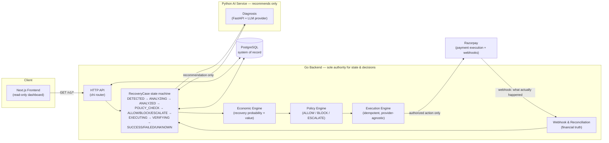

# RevGuard

**RevGuard recovers failed payments — automatically, safely, and provably.**

When a payment fails (insufficient funds, an expired mandate, an abandoned
checkout), RevGuard diagnoses why, calculates whether recovering it is
economically worth it, decides — under a fixed set of safety rules — whether
to act automatically or hand it to a human, executes that action through a
real payment provider, and verifies the *actual* financial outcome via
webhooks. Every step is audited and backed by PostgreSQL as the single
source of truth.

> **AI recommends. Policy decides. Infrastructure executes. Webhooks verify.
> Analytics proves.**

That sentence is the whole design. No layer is allowed to skip ahead of the
one before it — the AI can never authorize money movement, and nothing is
marked "recovered" until a webhook or reconciliation call confirms it really
was.

## Why this separation exists

A naive "AI decides, then acts" pipeline is exactly what you don't want
touching revenue: a hallucinated recommendation becomes a real charge with
no checkpoint in between. RevGuard instead treats the AI as one opinion
among several inputs to a deterministic policy layer, which is the *only*
thing allowed to authorize execution — see
[`docs/decisions/0002-three-layer-separation.md`](./docs/decisions/0002-three-layer-separation.md)
for the full reasoning.

## Architecture



**The rule this diagram encodes:** the AI box only ever feeds a
recommendation *into* the policy layer — it has no arrow to PostgreSQL or to
Razorpay. Only the Execution Engine talks to the payment provider, and only
after Policy Engine has produced an `ALLOW`. Only a webhook or a
reconciliation call — never an execution result by itself — is allowed to
mark an outcome as financially `SUCCESS`.

### Recovery case lifecycle

```
DETECTED → ANALYZING → ANALYZED → POLICY_CHECK ─┬─ ALLOW → EXECUTING → VERIFYING ─┬─ SUCCESS
                                                  ├─ BLOCK → CLOSED                 ├─ FAILED
                                                  └─ ESCALATE                       └─ UNKNOWN
```

Every transition is validated against a fixed table (no ad-hoc jumps), and
every step writes an immutable audit event.

## Tech stack

| Layer | Technology | Role |
|---|---|---|
| Core backend & authority | **Go** | owns all state, all decisions, all writes |
| AI / ML / LLM service | **Python + FastAPI** | produces diagnoses & recommendations only |
| Durable source of truth | **PostgreSQL** | the only system of record |
| Idempotency / coordination / cache | **Redis** | never used as a system of record |
| Event streaming | **Redpanda** | Kafka-API compatible, carries events between services |
| Frontend | **Next.js + TypeScript** | read-only dashboard |
| Local dev | **Docker Compose** | one command brings up the whole stack |

## How a payment gets recovered

1. **Ingest** — `POST /events` receives a `payment.failed`-type event,
   idempotently creates/correlates a `RecoveryCase`.
2. **Diagnose** — the AI service is asked for a structured recommendation
   (failure category, recommended action, confidence). It never touches
   infrastructure.
3. **Evaluate** — the Economic Engine independently estimates recovery
   probability and computes expected incremental value — AI confidence is
   deliberately *not* treated as recovery probability
   ([ADR 0001](./docs/decisions/0001-economic-engine-probability-vs-confidence.md)).
4. **Decide** — the Policy Engine applies fixed, versioned rules (confidence
   floor, amount ceiling, attempt limits, allowed-action list) to produce
   `ALLOW`, `BLOCK`, or `ESCALATE`. This is the only authority for what
   happens next.
5. **Execute** — on `ALLOW`, `POST /execute` reloads the authorized action
   from PostgreSQL (never a client-supplied value) and runs it through a
   `PaymentProvider` abstraction (fake provider for tests, Razorpay Test
   Mode for real execution).
6. **Verify** — a signature-verified Razorpay webhook (or an on-demand
   `POST /reconcile`) is the *only* thing that can mark the case
   `SUCCESS`/`FAILED`/`UNKNOWN`. "Execution succeeded" is never assumed to
   mean "revenue recovered."
7. **Prove** — an offline, synthetic evaluation harness
   (`go run ./cmd/evaluate`) benchmarks RevGuard's decisions against simpler
   baselines (fixed retry, static rules) to quantify the trade-off honestly,
   including when RevGuard loses on raw recovered revenue.

Full pipeline docs, one per stage: [event ingestion](./docs/architecture/event-flow.md) ·
[AI diagnosis](./docs/architecture/ai-diagnosis.md) ·
[economic engine](./docs/architecture/economic-engine.md) ·
[policy engine](./docs/architecture/policy-engine.md) ·
[execution engine](./docs/architecture/execution-engine.md) ·
[webhooks & reconciliation](./docs/architecture/webhooks-reconciliation.md) ·
[evaluation harness](./docs/architecture/evaluation-engine.md)

## Repository layout

```
revguard/
├── backend/          Go core backend — API, domain logic, state machine, engines
├── ai-service/        Python FastAPI — diagnosis/recommendation only, no DB access
├── frontend/          Next.js + TypeScript — read-only dashboard
├── docs/
│   ├── architecture/  one doc per pipeline stage (diagrams + rationale)
│   └── decisions/     ADRs for the non-obvious calls
├── scripts/           dev/ops scripts
├── tests/             cross-service/integration tests
├── docker-compose.yml
└── CLAUDE.md          locked architecture + full milestone-by-milestone history
```

## Quick start (local dev)

```bash
cp .env.example .env
docker compose up -d --build
cd backend && go run ./cmd/migrate -command up && cd ..

curl http://localhost:8080/health   # backend
curl http://localhost:8000/health   # ai-service
open http://localhost:3000          # frontend
```

Try the pipeline end to end:

```bash
curl -X POST http://localhost:8080/events \
  -H "Content-Type: application/json" \
  -d '{
    "event_id": "evt-123",
    "event_type": "payment.failed",
    "aggregate_type": "payment",
    "aggregate_id": "<existing payment UUID>",
    "merchant_id": "<that payment'"'"'s merchant UUID>",
    "occurred_at": "2026-01-01T00:00:00Z",
    "payload": {"reason": "insufficient_funds"}
  }'
```

A qualifying event runs `DETECTED → ANALYZED → POLICY_CHECK → {ALLOW, BLOCK,
ESCALATE}` in that single request. If it lands on `ALLOW`:

```bash
curl -X POST http://localhost:8080/v1/recovery-cases/<id>/execute   # empty body
curl http://localhost:8080/v1/recovery-cases/<id>                   # inspect the case
```

Run services individually (Go / Python / Next.js commands, and everything
about running the synthetic evaluation harness) are documented in
[CLAUDE.md](./CLAUDE.md).

### Services (Docker Compose)

| Service    | Port(s)                | Purpose                             |
|------------|-------------------------|--------------------------------------|
| postgres   | 5432                    | durable source of truth              |
| redis      | 6379                    | idempotency / coordination / cache   |
| redpanda   | 9092, 8081, 8082, 9644  | event streaming (Kafka API)          |
| backend    | 8080                    | Go core backend / API                |
| ai-service | 8000                    | Python FastAPI AI/ML service         |
| frontend   | 3000                    | Next.js dashboard                    |

## Deployment

See [`docker-compose.prod.yml`](./docker-compose.prod.yml) and CLAUDE.md's
**Deployment** section for the minimal 4-process production footprint
(backend, ai-service, frontend, PostgreSQL — Redis/Redpanda are declared for
future milestones, not required today), required environment variables,
health checks, webhook setup, rollback procedure, and the security
checklist.

**Known gap, read before exposing this publicly:** no endpoint currently
requires authentication. This is a deliberate, documented placeholder, not
an oversight — see the security checklist in CLAUDE.md before running this
beyond a controlled demo.

## Status

RevGuard has been verified end-to-end against **real Razorpay Test Mode**
(real Payment Links, a real webhook delivered over the public internet, real
signature verification) — see CLAUDE.md's Milestone 11 for the exact
verification log. All financial figures in the evaluation harness are
synthetic and clearly labeled as such; nothing claims validation against
live production data.

For the full milestone-by-milestone build history, test counts, and
verification logs, see [CLAUDE.md](./CLAUDE.md).
